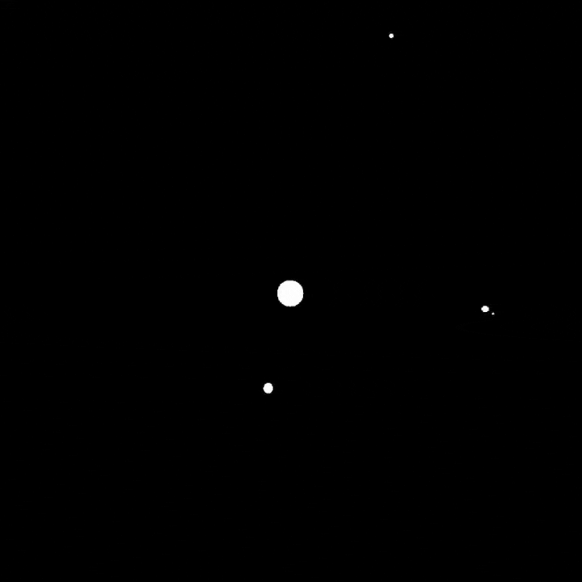
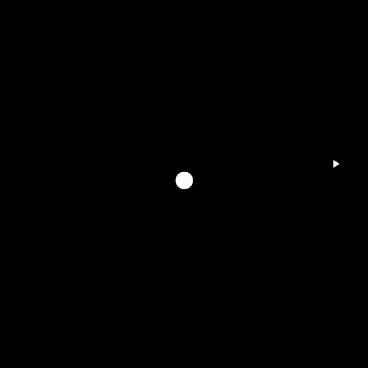

# Orbital Mechanics Simulator

A **Processing-Java** project that demonstrates real-time Newtonian gravity, orbital dynamics, and user-controlled spacecraft thrust.  
Built for my software-engineering portfolio to showcase physics programming, graphics, and clean code structure.

---

## Demo

| Realistic System | Rocket Control |
|------------------|----------------|
|  |  |

---

## Features

- **Accurate physics** — Universal Gravitation with the real constant G = 6.674 × 10⁻¹¹ m³·kg⁻¹·s⁻²  
- **Interactive rocket** — Rotate with **← / →** and apply thrust with **Space**; exhaust particles fade out over time.  
- **Multiple bodies** — Easily add or remove `Body` instances; each is rendered and updated in each physics step.  

---

## Controls

| Key           | Action                               |
|---------------|--------------------------------------|
| **← / →**     | Rotate rocket (counter-/clockwise)   |
| **Space**     | Toggle thrust (hold to accelerate)   |

---

## Running the Simulator

1. **Install Processing** (4.x or newer) — <https://processing.org/download>  
2. Clone this repo or download the `.zip`.  
3. Open `orbit-sim.pde` in Processing.  
4. Click **Run** ▶ — the 900×900 window launches immediately.

Feel free to fork or reach out with questions!